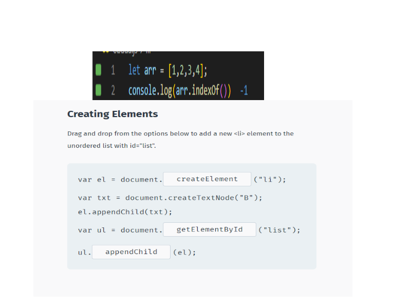
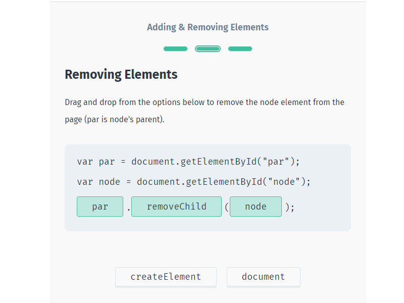
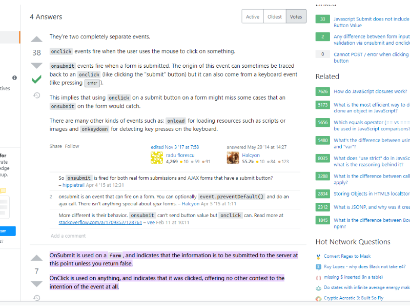
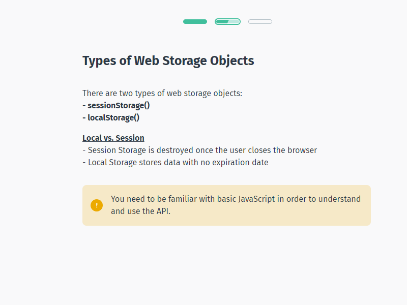
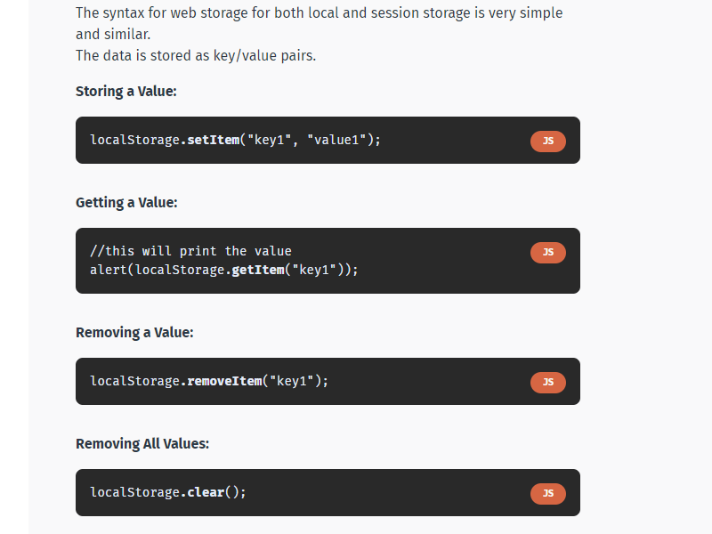
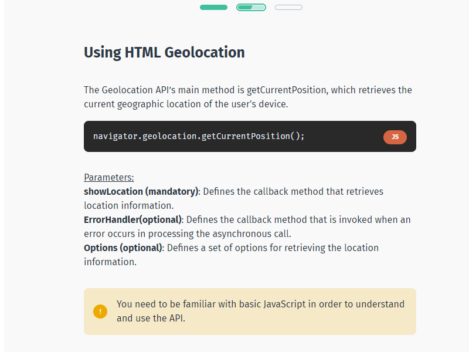
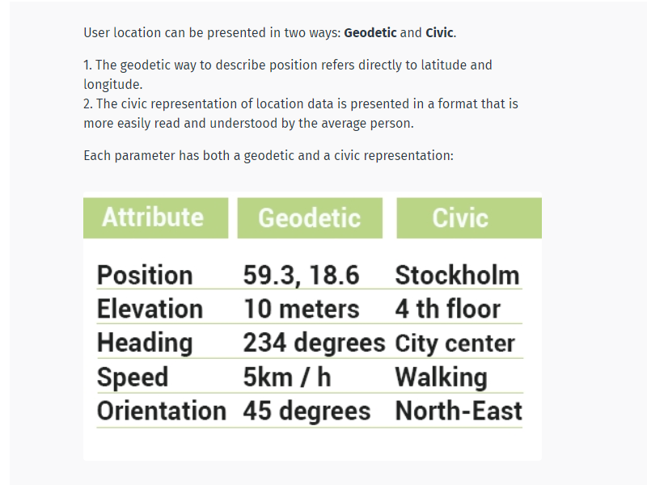
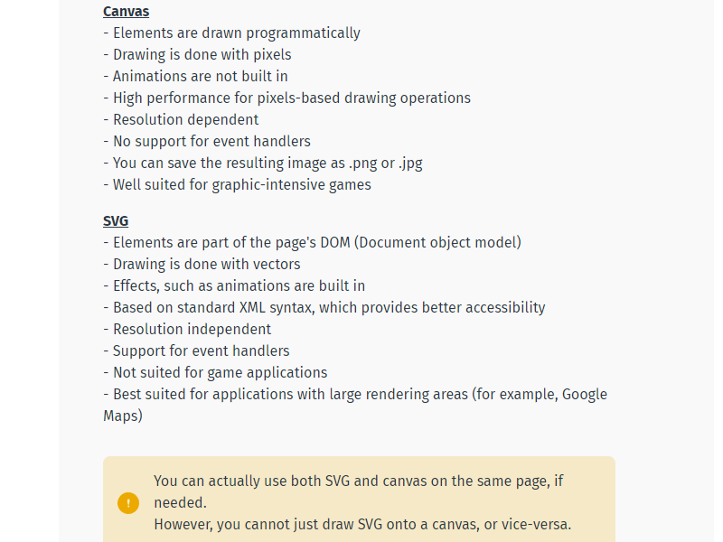
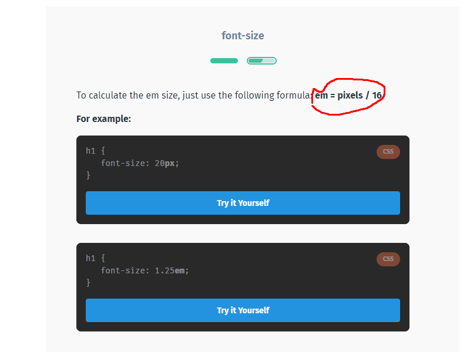
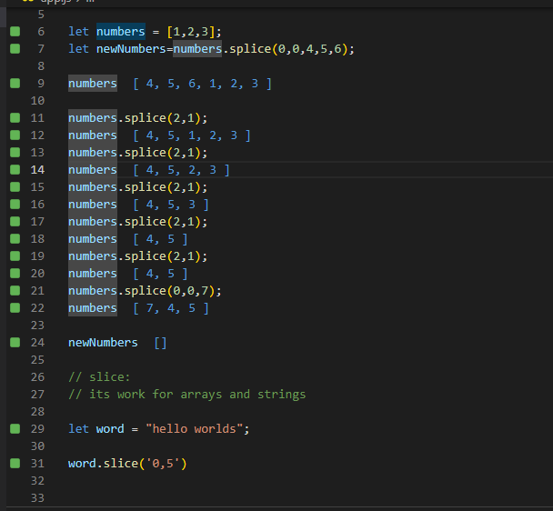

# oop:


# loops in js : 
```
let obj = {a: 1, b: 2, c: 3};
for (let k in obj) {
    console.log(k);
}

```
The for...in loop should NOT be used to iterate over arrays because, depending on the JavaScript engine, it could iterate in an arbitrary order. Also, the iterating variable is a string, not a number, so if you try to do any math with the variable, you'll be performing string concatenation instead of addition.

```
let list = ["x", "y", "z"];
for (let val of list) {
    console.log(val);
}


```

The for...of loop also works on the newly introduced collections (Map, Set, WeakMap, and WeakSet). We will learn about them in the upcoming lessons.
Note that ES6 code will run only in browsers that support it. Older devices and browsers that do not support ES6 will return a syntax error.


# ES6:
## Array Destructuring in ES6


The destructuring assignment syntax is a JavaScript expression that makes it possible to unpack values from arrays, or properties from objects, into distinct variables.

main syn: ` let [] or {} = [] or {}`
```
let arr = ['1', '2', '3'];

let [one, two, three] = arr;

console.log(one); // 1
console.log(two); // 2
console.log(three); // 3

-------------------------------------------
let obj = {h:100, s: true};
let {h, s} = obj;

console.log(h);
console.log(s);


-------------------------------------------
var o = {h: 42, s: true};
var {h: foo, s: bar} = o;

//console.log(h); // Error
console.log(foo); // 42

```
## ES6 Rest Parameters:

to unpack values from arrays
or pack the values to arrays in functions.

```
function containsAll(arr, ...nums) {
    for (let num of nums) {
        if (arr.indexOf(num) === -1) {
            return false;
        }
    }
    return true;
}

let x = [2, 4, 6, 7];
console.log(containsAll(x, 2, 4, 7));
console.log(containsAll(x, 6, 4, 9));


9 not in x its mean the index of 9 is -1

-------------------------------------------------------
const myFunction = (w, x, y, z) => {
    console.log(w + x + y + z);
};
let args = [1, 2, 3];
myFunction(...args, 4);   //فرط args


```
...nums become an array.
9 not in x its mean the index of 9 is -1



object فرط ال
with key and val.
```
const obj1 = { foo: 'bar', x: 42 };
const obj2 = { foo: 'baz', y: 5 };

const clonedObj = { ...obj1 }; // { foo: "bar", x: 42 }
const mergedObj = { ...obj1, ...obj2 }; // { foo: "baz", x: 42, y: 5 }


```


# Classes in ES6 :

```

class Rectangle {
    constructor(height, width) {
        this.height = height;
        this.width = width;
  }
}

const square = new Rectangle(5, 5);
const poster = new Rectangle(2, 3); 

console.log(square.height); // 5


```


```
class Rectangle {
  constructor(height, width) {
    this.height = height;
    this.width = width;
  }
  
  get area() {
    return this.calcArea();
  }

  calcArea() {
    return this.height * this.width;
  }
}

const square = new Rectangle(5, 5);

console.log(square.area); // 25

`In the code above, area is a getter, calcArea is a method.`


```

```

Another type of method is the static method, which cannot be called through a class instance. Static methods are often used to create utility functions for an application.

class Point {
  constructor(x, y) {
    this.x = x;
    this.y = y;
  }

  static distance(a, b) {
    const dx = a.x - b.x;
    const dy = a.y - b.y;

    return Math.hypot(dx, dy);
  }
}

const p1 = new Point(7, 2);
const p2 = new Point(3, 8);

console.log(Point.distance(p1, p2));

`As you can see, the static distance method is called directly using the class name, without an object.`

```


```
inhertant by using extends:

class Animal {
  constructor(name) {
    this.name = name;
  }
  speak() {
    console.log(this.name + ' makes a noise.');
  }
}

class Dog extends Animal {
  speak() {
    console.log(this.name + ' barks.');
  }
}
let dog = new Dog('Rex');
dog.speak(); // Rex barks.


```

If there is a constructor present in the subclass, it needs to first call super() before using this. Also, the super keyword is used to call parent's methods.


```
class Animal {
  constructor(name) {
    this.name = name;
  }
  speak() {
    console.log(this.name + ' makes a noise.');
  }
}

class Dog extends Animal {
  speak() {
    super.speak(); // Super
    console.log(this.name + ' barks.');
  }
}

let dog = new Dog('Rex');
dog.speak();
// Rex makes a noise.
// Rex barks.


```
# Map & Set:
```
let map = new Map([['k1', 'v1'], ['k2', 'v2']]);

console.log(map.size); // 2

using a Map preferable in certain cases:
1) The keys can be any type including functions, objects, and any primitive.
2) You can get the size of a Map.
3) You can directly iterate over Map.
4) Performance of the Map is better in scenarios involving frequent addition and removal of key/value pairs.


Methods
set(key, value)=====> Adds a specified key/value pair to the map. If the specified key already exists, value corresponding to it is replaced with the specified value.
get(key)=====> Gets the value corresponding to a specified key in the map. If the specified key doesn't exist, undefined is returned.
has(key)=====> Returns true if a specified key exists in the map and false otherwise.
delete(key)=====> Deletes the key/value pair with a specified key from the map and returns true. Returns false if the element does not exist.
clear()======> Removes all key/value pairs from map.
keys()======> Returns an Iterator of keys in the map for each element.
values()======> Returns an Iterator of values in the map for each element.
entries()=======> Returns an Iterator of array[key, value] in the map for each element.


Map supports different data types i.e. 1 and "1" are two different keys/values.


```

```
set:

A Set object can be used to hold unique values (no repetitions are allowed).
A value in a set can be anything (objects and primitive values).

The syntax new Set([iterable]) creates a Set object where iterable is an array or any other iterable object of values.

The size property returns the number of distinct values in a set.
For example:


let set = new Set([1, 2, 4, 2, 59, 9, 4, 9, 1]);

console.log(set.size); // 5


Methods
add(value)===> Adds a new element with the given value to the Set.
delete(value)===> Deletes a specified value from the set.
has(value)===> Returns true if a specified value exists in the set and false otherwise.
clear() ===>Clears the set.
values()===> Returns an Iterator of values in the set.


```

# ES6 Promises :

A Promise is a better way for asynchronous programming when compared to the common way of using a setTimeout() type of method.

```

setTimeout(function() {
    console.log("Work 1");
    setTimeout(function() {
        console.log("Work 2");
    }, 1000);
}, 1000);
console.log("End");


------------------------------
new Promise(function(resolve, reject) {
    // Work
    if (success)
        resolve(result);
    else
        reject(Error("failure"));
}); 


Here, resolve is the method for success and reject is the method for failure.

If a method returns a promise, its calls should use the then method which takes two methods as input; one for success and the other for the failure.

For Example:

function asyncFunc(work) {
    return new Promise(function(resolve, reject) {
        if (work === "")
            reject(Error("Nothing"));
        setTimeout(function() {
            resolve(work);
        }, 1000);
    });
}

asyncFunc("Work 1") // Task 1
.then(function(result) {
    console.log(result);
    return asyncFunc("Work 2"); // Task 2
}, function(error) {
    console.log(error);
})
.then(function(result) {
    console.log(result);
}, function(error) {
    console.log(error);
});
console.log("End");


It also prints "End", "Work 1" and "Work 2" (the work is done asynchronously). But, this is clearly more readable than the previous example and in more complex situations it is easier to work with.

```

# Iterators & Generators:

[sololearn link](https://www.sololearn.com/learning/1024/2981/6544/1) \
[youtube link](https://www.youtube.com/watch?v=ZNrJPzjNt-o)

`console.dir(arr)` to get detalies on somthing like array its itertibal object.

# Modules :

sololearn link https://www.sololearn.com/learning/1024/2981/6545/1

`import * ​as math from "lib/mat`


# arrow function : 

Understanding the differences between regular and arrow functions helps choose the right syntax for specific needs.

<mark>this value inside a regular function is dynamic and depends on the invocation. But this inside the arrow function is bound lexically and equals to this of the outer function.

arguments object inside the regular functions contains the list of arguments. The arrow function, on the opposite, doesn't define arguments (but you can easily access the arrow function arguments using a rest parameter ...args).

<mark>If the arrow function has one expression, then the expression is returned implicitly, even without using the return keyword.

Last but not least, you can define methods using the arrow function syntax inside classes. Fat arrow methods bind this value to the class instance.

Anyhow the fat arrow method is invoked, this always equals the class instance, which is useful when the methods are used as callbacks.

To understand all types of functions in JavaScript, I recommend checking 6 Ways to Declare JavaScript Functions.


# Dom:
```
//finds element by id
document.getElementById(id) 

//finds elements by class name
document.getElementsByClassName(name) 

//finds elements by tag name
document.getElementsByTagName(name)

```


```
//calling the function in window.onload to make sure the HTML is loaded
window.onload = function() {
    //creating a new paragraph
    var p = document.createElement("p");
    var node = document.createTextNode("Some new text");
    //adding the text to the paragraph
    p.appendChild(node);

    var div = document.getElementById("demo");
    //adding the paragraph to the div
    div.appendChild(p);
};


```


```

var el = document.

("li");


var txt = document.createTextNode("B");


el.appendChild(txt);


var ul = document.

("list");


ul.

(el);

```


```
//calling the function in window.onload to make sure the HTML is loaded
window.onload = function() {
    var parent = document.getElementById("demo");
    var child = document.getElementById("p1");
    parent.removeChild(child);
};

```



## set intervil and style :
https://www.sololearn.com/learning/1024/2756/5844/1

## Handling Events:

https://www.sololearn.com/learning/1024/2758/5846/1
```
Event Propagation

https://www.sololearn.com/learning/1024/2759/5850/1


There are two ways of event propagation in the HTML DOM: bubbling and capturing.

Event propagation allows for the definition of the element order when an event occurs. If you have a <p> element inside a <div> element, and the user clicks on the <p> element, which element's "click" event should be handled first?

In bubbling, the innermost element's event is handled first and then the outer element's event is handled. The <p> element's click event is handled first, followed by the <div> element's click event.

In capturing, the outermost element's event is handled first and then the inner. The <div> element's click event is handled first, followed by the <p> element's click event.

```




## local storge :






## Geolocation:





# SVG stands for Scalable Vector Graphics, and is used to draw shapes with HTML-style markup. go sololearn.com html svg





## emVpx:



## The z-index works only on positioned elements (position:absolute, position:relative, or position:fixed).


# splice slice split :



# create a server:
```
const http = require('http');
const fs = require('fs');
const server = http.createServer((req,res)=>{
    res.writeHead(200,{'Content-Type':'text/html'});
    fs.readFile('index.html', (error,data)=>{
        if(error){
            res.writeHead(404);
            res.write('Error:File not found')
        }else{
            res.write(data);

        }
        res.end()
    })
})

server.listen(3000)
```


