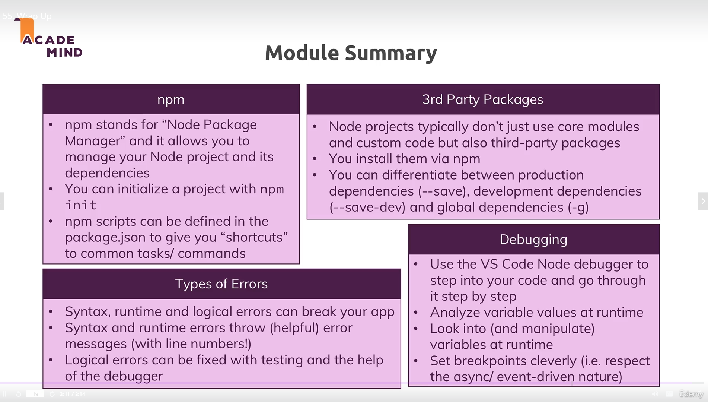

# NodeJS:
its make the js work outside the browser (runtime enviroment to exuict the code outside the browser)
its help us to make apis
you can work with network and more things that the browser can not do it 

# 1-9


# thread:
when we handel a request a thread will take our request


```
let time= setTimeout(()=>{console.log('obada')},3000);


 //stop the setTimeout
 clearTimeout(time)

 let obada=setInterval(() => {
     console.log('obada')
     
     
 }, 3000);


 clearInterval(obada) // stop the setInterval function


//  globalscop in nodejs 
// window in browser

```


# why module whats the module:

we dfinde variavles in objects to do not override each other on the global obj


modele is a file have all variables :


# `console.log(module)`:


# Example

```
file 1 :(module1)

var url = "http://mylogger.io/log";

function log(massage){
    
    console.log(massage);
}

//we can use this anyware 
module.exports.log=log;

```
```
file2:(module2)
const logger = require('./logger');
logger.log('massage');


```

# node Function:


# node js modules built in
```
//some modules in nodejs

const path = require('path');

var pathObj= path.parse(__filename);

const os=require('os');

const myinfo = os.totalmem()

const free= os.freemem()


console.log(`Total Memory ${myinfo} free: ${free}` )


const fs = require('fs');

const files = fs.readdirSync('./')
console.log(files)

fs.readdir('./',function(err,files){
    if (err) console.log('Error',err);
    else console.log('Result',files)
})


```

# events in nodejs:


# classes and inhertants (extends):


# how to create a server in js :


# RestApi Vs Api :


# some concept :


# they call the node termenl repl

# primitive and refernce:


# some methods :


# Promises :


# How web works :


Core Modules outside of the node packges

# Create the server :
```
const http = require("http");

const server = http.createServer((req, res) => {
  console.log(req);
});

server.listen(9000);

```

# to kill the node :

```
taskkill /f /im node.exe

```

# some intro coding in node js :
```
const http = require("http");
const fs = require('fs');

const server = http.createServer((req, res) => {
  const url = req.url;
  const method = req.method;
  if (url==='/'){

    res.setHeader('Content-type','text/html');
    res.write('<html>')
    res.write('<head><title>My page</title></head>')
    res.write('<body><form action="/message" method="POST" name="message"><input type="text"><button type="submit" >send</button></form></body>')
    res.write('</html>')
    return res.end();

  }
  if (url === '/message' && method === 'POST'){
      fs.writeFileSync('message.txt','DUMMY');
      res.statusCode = 302;
      res.setHeader('Locaation','/');
      return res.end()
  }

  res.setHeader('Content-type','text/html');
  res.write('<html>')
  res.write('<head><title>My page</title></head>')
  res.write('<body><h1>hellow</h1></body>')
  res.write('</html>')
  res.end();
  
});

server.listen(3000);


```

# crazyloop:


buffers and streams are help us to avoide the double responses.

# module:
```
file 1 name : router.js
module.exports = requesHandler; //function you can use obj to take many 

file 2 name app.js:

const routs = require('./router.js);

routs.requesHandler

```

# start a project:
1. `npm init`

2. `npm install whatUneedPackges`

3. `npm install` help you to install all packges that you need




# middle ware (express):
dvide your wotk in functions


# express Steps :

```

//create a server


//express frame work help you to do ez project
const express = require('express');
const app = express();


app.use('/',(req,res,next)=>{
console.log('In the middle ware') //,Alows us to continue to the next middle ware in line
res.send('obada')
});


  app.listen(3000);


```

# express methods :

get , post ,put ,delete,patch

1. what i know that the get is go to the rout exactly use make more things
2. you can use for any rout


# create server using express:

```
const express = require("express");

const path = require("path");
// const router = express.Router()

app = express();

app.get("/add-product", (req, res, next) => {
  res.sendFile(path.join(__dirname, "../", "views", "add-product.html"));
});

app.listen(4000);

```


